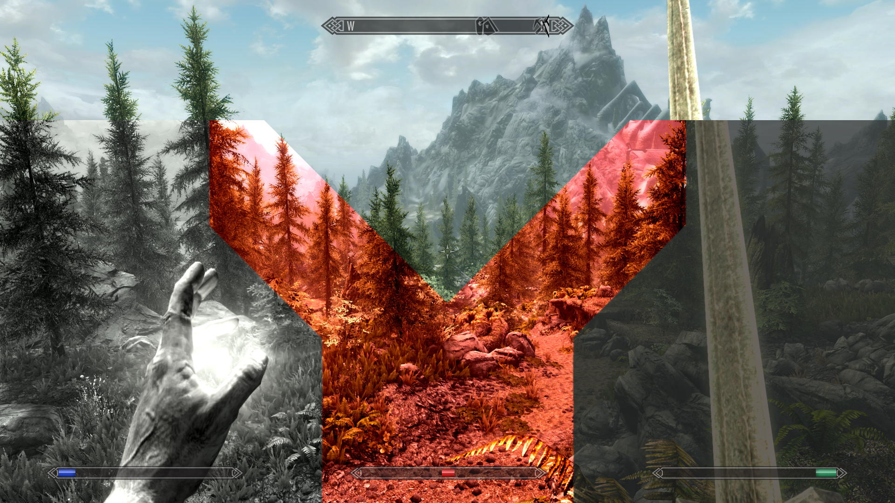

# StatFX: ImageSpace Modifiers for Health, Magicka, and Stamina

A lightweight SKSE plugin to add imagespace modifiers (aka screen overlay effects / color filters) that dynamically fade in and out depending on the player's main stats' resource percentages.

Extremely configurable using the ini file.

**Created with VR in mind**, and those who like to play Skyrim immersively with minimal HUD.

This plugin gives a responsive and tactile experience to understand your changing statuses in combat, without needing to un-immersively dart your eyes around looking for the size of some resource bars and doing math in your head.

### Inspired by [Better Resource Warnings](https://www.nexusmods.com/skyrimspecialedition/mods/26751), and can be used with or without it.
- **BRW is great to configure the vanilla low-resource indicators** (e.g. heavy breathing for stamina or heartbeat for health).
- However, it has some shortcomings with its implementation of Imagespace Modifiers
  - A bit Papyrus-script heavy
  - Inconsistent/laggy screen update timing dependant on spell effects firing said scripts.
  - MCM configuration means messing around with in-game UI for every save and can be a mixed bag
  - Has some broken/incompatible config combinations with cinematic and tint modifiers stacking on top each other, esp. for VR
- **StatFX was designed to improve on those shortcomings**
  - is multithreaded and all native C++ (basically zero performance impact from a fair amount of testing)
  - has smooth and responsive transitions in the screen effect filters when taking damage, casting spells, doing power attacks, etc.
  - much more configurable, using a simple, commented ini file
  - the esp is literally three bog-default imod forms and zero script refs -- trivially easy to merge.

## Installation
Get StatFX from [Nexus](//TODO) and install like any other mod (hopefully using a mod manager like [MO2](https://www.nexusmods.com/skyrimspecialedition/mods/6194))

## Configuration
Edit [StatFx.ini](StatFx.ini) in the Data/SKSE/Plugins folder.
> If you are using MO2, just double click the mod on the main panel and use the Filetree tab to open the mod folder. You can even make your own ini config presets seperate mini-mods and have it load lower on the list (recommended).

The config file is commented with more details.

- ☑️ Config file is standard ini syntax (*one key-value pair per line with equals sign, comment lines start with semi-colon, no in-line/trailing comments*)
- ☑️ Stamina, Magicka, and Health sections with symmetrical config keys -- for their respective screen effect.
- ☑️ Enable or disable any part of any effect
- ☑️ Add any **tint color** at any strength (defined by Red-Green-Blue-Alpha values)
- ☑️ Add any color **contrast** filter, **brightness** filter, and **saturation** filter (with additive and multiplicative values)
- ☑️ **Interpolate** the effects between any starting and ending **range**. *Maybe you fade over the full 100% for your health bar, but only between 10% and 50% for stamina?*
- ☑️ Use any standard [easing function](https://easings.net) to give the effect a **curve** over the interpolated range. *Basic Linear or maybe some Ease-Out-Sine etc. You're a psycho and want it to bounce around? Get some help.*
- ☑️ Choose the **smoothing factor** for animating the effect for abrupt changes. *Took a huge hit or made a power attack? Fade in the full effect over a sec.*
- ☑️ Adjust the script's asynchronous **update frequency**. *Unnoticable performance impact even at close to 60 fps update times.*

### Defaults set according to my personal preference playing with VR and no HUD
- Strong color and cinematic filters that slowly start to fade on a late quadratic curve. Cold desaturation for magicka, red contrast for health, and gray-out darkness for stamina

### An aside: why .ini files (when suitable) over MCM?
- MCM is best suited for gameplay-centric mods, where you want things to be adjustable on the fly and/or specific to you current save file character
- MCMs are good when your settings have complex rules / is dynamic to gameplay state, and would be error-prone to write configs for without validated inputs
- Config files are easy to create, share, download, and switch-in and -out using mod managers like how all other modding related artifacts already work.
- Mod creators don't need to put resources into debugging GUI stuff and real-time changes and edge-cases (for otherwise straightforward functionality)
- Give users MOAR CONFIGS and trust them to tweak things as they please, even to their breaking points.
- Let's not add to the "This meeeting could have been an email" pile of MCM menus in our mod lists

## Compatibility
- ✅ Can be used alongside any other mod
- ✅ Can be installed and removed at any time
- 🔶 If using with Better Resource Warnings, make sure to disable all ImagespaceModifiers in its MCM menu.
- 🔶 *Probably not* compatible with ENBs. Doesn't hurt to run, but might not properly display the screen effects.
  - The vanilla color overlays are usually ignored by the post process shader used by most ENBs, though some have it as a setting variable like "Apply Game Color Correction". YMMV.
- ✅ Built for CommonLibSSE-NG and supports Skyrim SE, AE, and VR.

## Any issues?
StatFX is written to peacefully shut down the plugin if there are bad configs. I have not encountered any CTD causing states.
- If you believe it is causing a crash, isolate the issue first by unchecking the mod on MO2 and confirming that the crash does not persist
- Make sure you have the correct esp file loaded alongside the dll plugin (should be packaged together if you got it from nexus)
- Open the `StatFX.log` file (Probably in your `C:\Users\{name}\Documents\My Games\Skyrim\SKSE` or something similar in your "My Games" directory)
  - If the plugin is seemingly not working or reverting to default settings, you'll see logs that it cant find the ini or bad config syntax
    - Try fixing any syntax issues in the config file, using the default as reference
  - For any other issues, share the logfile (with pastebin or attachment) when asking for help. You can use the issues page or the Nexus comments.

## Mod developers
This plugin was based on the Log File template from [Skyrim Scripting](https://github.com/SkyrimScripting/SKSE_Templates). Follow the instructions on that page to figure out how set up your environment and build the plugin dll.

Clone this repo and open the folder with VS22 or VScode, and it should Just Work™️

(When testing, make sure to grab the .esp from Nexus or make your own which has the template ImagespaceModifier forms with EditorIDs matching the ini.)

Also, this is my first SKSE plugin, so any feedback or pull requests are appreciated! Feel free to use Issues.
- *In particular, if anyone knows how to add TESForms programatically when the plugin is loaded rather than need some template forms. I'd love to get rid of the otherwise useless esp*
- *If there are any profiler nerds reading this, some numbers on performence impact would be nice to confirm!*

## Credits
- Skyrim Scripting for the excellent SKSE tutorials and templates
- metayeti for [mINI](https://github.com/metayeti/mINI)
- nicolausYes for [easing-functions](https://github.com/nicolausYes/easing-functions)
- QuantumEntangledAndy for code reference: [GTS_Plugin](https://github.com/QuantumEntangledAndy/GTS_Plugin)
- Phoenix2496 for inspiration: [Better Resource Warnings](https://www.nexusmods.com/skyrimspecialedition/mods/26751)
- CharmedBaryon and co. for powering [CommonLibSSE-NG](https://github.com/CharmedBaryon/CommonLibSSE-NG)
- The SKSE team and Bethesda of course!

## Licence
[MIT](/LICENSE)